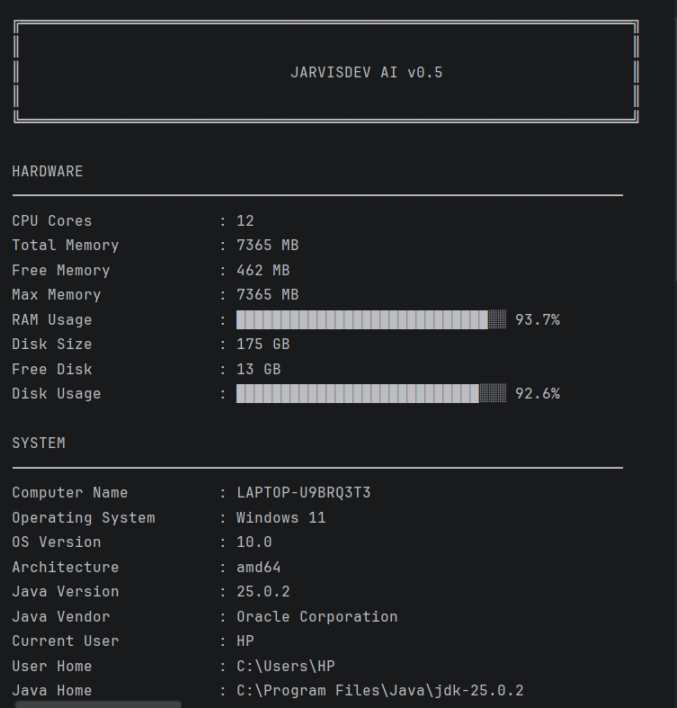
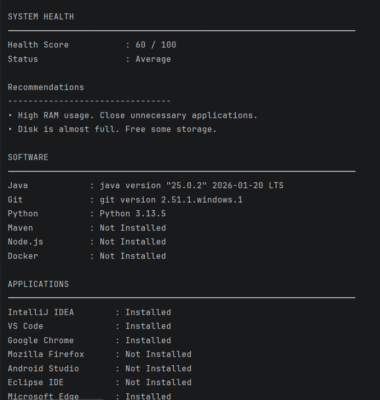
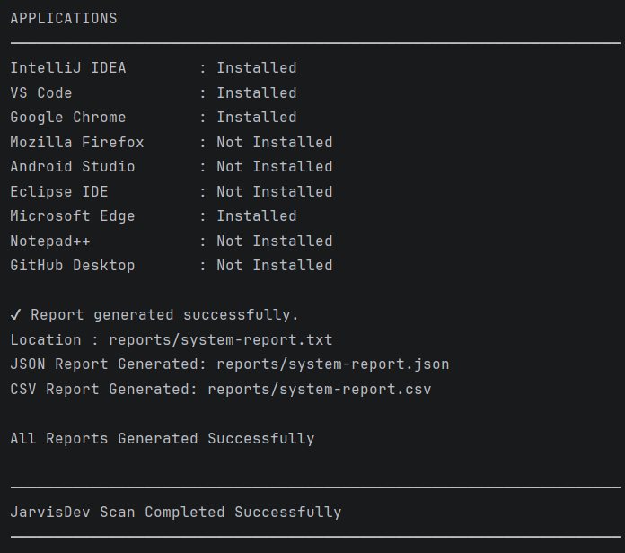

# 🤖 JarvisDev AI

A Java-based System Diagnostics & Developer Assistant Platform.

---

## 📌 About

JarvisDev AI helps developers analyze and understand their system environment.

Current capabilities include:

- 🖥️ Hardware Scanning
- ⚙️ System Information Detection
- 📦 Software Detection
- 🧩 Application Detection
- ❤️ Health Analysis
- 📄 TXT Report Generation
- 📊 CSV Report Generation
- 🗂️ JSON Report Generation

---

## 🚀 Current Version

### v0.3 - Software Scanner

### Completed Features

| Feature | Status |
|----------|---------|
| System Scanner | ✅ |
| Hardware Scanner | ✅ |
| Software Scanner | ✅ |
| Application Scanner | ✅ |
| Health Analyzer | ✅ |
| TXT Reports | ✅ |
| JSON Reports | ✅ |
| CSV Reports | ✅ |

---

## 🛠️ Technology Stack

- Java 25
- Maven
- Git
- IntelliJ IDEA

---

## 📸 Screenshots

### Dashboard



### Health Analysis



### Generated Reports



---

## 📂 Project Structure

```text
jarvisDev
│
├── src
│   └── main
│       └── java
│           └── com.jarvisdev
│
│               ├── Main.java
│
│               ├── analysis
│               │   ├── HealthAnalyzer.java
│               │   └── HealthReport.java
│
│               ├── models
│               │   ├── HardwareInfo.java
│               │   ├── SystemInfo.java
│               │   ├── SoftwareInfo.java
│               │   ├── SoftwareResult.java
│               │   └── ApplicationInfo.java
│
│               ├── repository
│               │   ├── SoftwareRepository.java
│               │   └── ApplicationRepository.java
│
│               ├── scanner
│               │   ├── SystemScanner.java
│               │   ├── hardware
│               │   │   └── HardwareScanner.java
│               │   ├── software
│               │   │   └── SoftwareScanner.java
│               │   ├── system
│               │   │   └── SystemInfoScanner.java
│               │   └── application
│               │       └── ApplicationScanner.java
│
│               ├── report
│               │   ├── ReportData.java
│               │   ├── ReportGenerator.java
│               │   ├── TxtReportWriter.java
│               │   ├── JsonReportWriter.java
│               │   └── CsvReportWriter.java
│
│               └── utils
│                   ├── ConsoleUI.java
│                   ├── DashboardPrinter.java
│                   └── ProgressBar.java
│
├── screenshots
│   ├── dashboard-v1.png
│   ├── health-analysis-v1.png
│   └── reports-generated-v1.png
│
├── README.md
├── pom.xml
└── .gitignore
```

---

## 🗺️ Roadmap

### v0.1
- ✅ System Scanner

### v0.2
- ✅ Hardware Scanner

### v0.3
- ✅ Software Scanner

### v0.4
- ⏳ Auto Installer

### v0.5
- ⏳ Project Generator

### v1.0
- 🤖 AI Developer Agent

---

## ▶️ Run Project

```bash
git clone <repository-url>
cd jarvisDev
mvn clean install
mvn exec:java
```

Or run:

```text
Main.java
```

directly from IntelliJ IDEA.

---

## 👨‍💻 Author

**Vikash Saroj**

B.Tech CSE | Java Developer | System Software Enthusiast